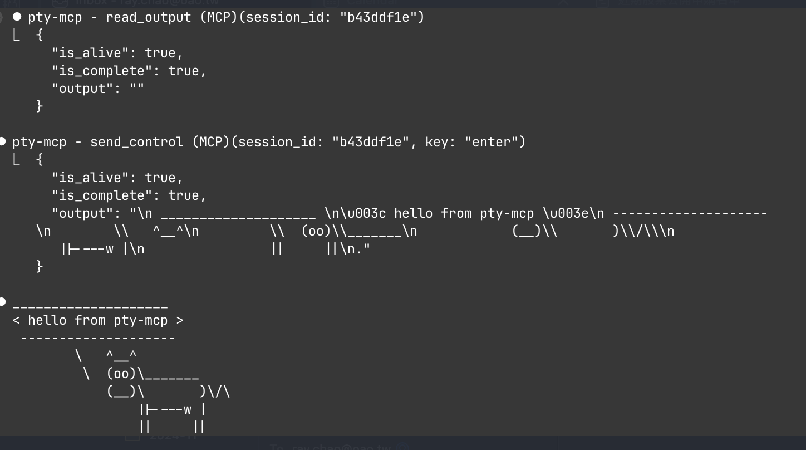

# pty-mcp

[](https://glama.ai/mcp/servers/raychao-oao/pty-mcp)

An MCP (Model Context Protocol) server that gives AI agents interactive terminal sessions — local shells, SSH, serial ports, and persistent remote sessions that survive disconnects.

Built for **sysadmins and network engineers** who want AI to help with real server and device management, not just code generation.



## Why

AI agents run commands in non-interactive shells. They can't:
- SSH into a server and interact with running processes
- Connect to routers or switches via serial console
- Monitor logs and react when a specific event occurs
- Keep session state across multiple commands
- Wait for a server to reboot and detect when it's back up

pty-mcp solves all of these by providing real PTY sessions over MCP.

## Use Cases

**Server administration**
```
# Reboot a server and wait until it's back online
create_local_session("ping myserver")
read_output(wait_for: "bytes from", timeout: 300)
→ blocks until server responds after reboot (~80s, one tool call)
```

**Network device management**
```
# Connect to a router via serial console
create_serial_session(port: "/dev/ttyUSB0", baud: 9600)
send_input("show interfaces status")
read_output(wait_for: "\\$")
```

**Log monitoring and alerting**
```
# Watch logs and act when something happens
create_ssh_session(host: "prod", user: "admin")
send_input("tail -f /var/log/app.log")
read_output(wait_for: "ERROR|CRITICAL", timeout: 3600)
→ returns the error line + context when it appears
```

**Long-running tasks that survive disconnects**
```
create_ssh_session(host: "server", user: "admin", persistent: true)
send_input("apt upgrade -y")
detach_session()          → close Claude Code, task continues
# Reconnect later to check result
```

## Features

| Feature | Description |
|---------|-------------|
| **Local terminal** | Interactive bash/python/node sessions on local machine |
| **SSH sessions** | Connect to remote hosts with key/password auth, SSH config support |
| **Serial port** | Connect to devices via serial (IoT, embedded, network gear) |
| **Persistent sessions** | Sessions survive SSH disconnects via `ai-tmux` daemon |
| **Attach/Detach** | Detach from a running session, reconnect later |
| **Control keys** | Send ctrl+c, ctrl+d, arrow keys, tab, escape |
| **Settle detection** | Waits for output to settle before returning (smart timeout) |
| **Pattern matching** | `wait_for` blocks until a regex pattern appears in output (v0.2.0) |
| **Bounded memory** | Ring buffer prevents OOM on long-running sessions (v0.2.0) |

## Architecture

```
┌─────────────────────────────────────────────────────┐
│ AI Agent (Claude Code, etc.)                        │
│                                                     │
│  MCP Tools: create_local_session, send_input,       │
│             send_control, read_output, close_session │
└──────────────────────┬──────────────────────────────┘
                       │ JSON-RPC stdio
┌──────────────────────┴──────────────────────────────┐
│ pty-mcp (MCP Server)                                │
│                                                     │
│  Session Manager                                    │
│  ├── LocalSession  (local PTY via creack/pty)       │
│  ├── SSHSession    (remote PTY via x/crypto/ssh)    │
│  ├── SerialSession (serial port via go.bug.st)      │
│  └── RemoteSession (persistent via ai-tmux)         │
└─────────────────────────────────────────────────────┘

Persistent mode (ai-tmux):

  pty-mcp ──SSH──▶ ai-tmux client ──Unix socket──▶ ai-tmux server (daemon)
                                                     ├── PTY: bash
                                                     ├── PTY: ssh admin@router
                                                     └── PTY: tail -f /var/log/syslog
```

## Quick Start

**One-line install + register** (macOS / Linux / WSL2):

```bash
curl -fsSL https://raw.githubusercontent.com/raychao-oao/pty-mcp/main/install.sh | sh
claude mcp add pty-mcp -- /usr/local/bin/pty-mcp
```

That's it. Restart Claude Code and the tools are available.

<details>
<summary><b>Other install methods</b></summary>

**Download from GitHub Releases:**

Go to [Releases](https://github.com/raychao-oao/pty-mcp/releases), download the binary for your platform, and make it executable:

| Platform | Binary |
|----------|--------|
| macOS (Apple Silicon) | `pty-mcp-darwin-arm64` |
| macOS (Intel) | `pty-mcp-darwin-amd64` |
| Linux (x86_64) / WSL2 | `pty-mcp-linux-amd64` |
| Linux (ARM64) | `pty-mcp-linux-arm64` |

```bash
chmod +x pty-mcp-*
sudo mv pty-mcp-* /usr/local/bin/pty-mcp
claude mcp add pty-mcp -- /usr/local/bin/pty-mcp
```

**Build from source** (requires Go 1.25+):

```bash
go install github.com/raychao-oao/pty-mcp@latest
claude mcp add pty-mcp -- $(go env GOPATH)/bin/pty-mcp
```

</details>

### WSL2 Notes

pty-mcp works in WSL2 out of the box. Use the Linux binary:

```bash
# Inside WSL2
curl -fsSL https://raw.githubusercontent.com/raychao-oao/pty-mcp/main/install.sh | sh
claude mcp add pty-mcp -- /usr/local/bin/pty-mcp
```

### Optional: Install ai-tmux on remote servers

For persistent sessions that survive SSH disconnects, install `ai-tmux` on your remote server:

```bash
# Download for your server's architecture
curl -fsSL https://raw.githubusercontent.com/raychao-oao/pty-mcp/main/install.sh | sh
# Or just copy the binary:
scp /usr/local/bin/ai-tmux your-server:/usr/local/bin/ai-tmux
```

### Usage Examples

Once registered, the AI agent can use these MCP tools:

**Local interactive shell:**
```
create_local_session()                    → {session_id, type: "local"}
send_input(session_id, "cd /tmp && ls")   → {output: "...", is_complete: true}
send_input(session_id, "python3")         → start Python REPL
send_input(session_id, "print('hello')")  → {output: "hello\n>>>"}
send_control(session_id, "ctrl+d")        → exit Python
close_session(session_id)
```

**SSH to remote server:**
```
create_ssh_session(host: "myserver", user: "admin")
send_input(session_id, "top")
send_control(session_id, "ctrl+c")        → stop top
```

**Wait for pattern (v0.2.0):**
```
create_local_session("ping myserver")
read_output(session_id, wait_for: "bytes from", timeout: 300)
→ blocks until server responds or 5 min timeout

send_input(session_id, "docker-compose up")
read_output(session_id, wait_for: "ready|error", timeout: 60, context_lines: 3)
→ returns matched line + 3 lines of context
```

**Persistent session (survives SSH disconnect):**
```
create_ssh_session(host: "server", user: "admin", persistent: true)
send_input(session_id, "make build")      → start long build
detach_session(session_id)                → disconnect, build continues

# Later (even after restart):
list_remote_sessions(host: "server", user: "admin")  → see running sessions
create_ssh_session(host: "server", user: "admin", session_id: "abc123")  → reattach
send_input(session_id, "echo $?")         → check build result
```

## MCP Tools

| Tool | Description |
|------|-------------|
| `create_local_session` | Start a local interactive terminal (bash, python3, node, etc.) |
| `create_ssh_session` | SSH to a remote host (supports SSH config aliases) |
| `create_serial_session` | Connect to a serial port device |
| `send_input` | Send a command and wait for output to settle |
| `read_output` | Read output, optionally wait for a pattern (`wait_for`, `timeout`, `context_lines`, `tail_lines`) |
| `send_control` | Send control keys (ctrl+c, ctrl+d, arrows, tab, etc.) |
| `list_sessions` | List all active sessions |
| `close_session` | Close a session (terminates remote PTY) |
| `detach_session` | Disconnect but keep remote PTY running |
| `list_remote_sessions` | List persistent sessions on a remote host |

## ai-tmux: Persistent Terminal Daemon

`ai-tmux` is a lightweight daemon that runs on remote servers, keeping PTY sessions alive across SSH disconnects. Think of it as tmux designed for AI agents.

### Install on remote server

```bash
# Cross-compile for Linux
GOOS=linux GOARCH=amd64 go build -o ai-tmux-linux ./cmd/ai-tmux/

# Copy to server
scp ai-tmux-linux server:~/ai-tmux
ssh server "chmod +x ~/ai-tmux && sudo mv ~/ai-tmux /usr/local/bin/ai-tmux"
```

### How it works

- `ai-tmux server` — daemon mode, listens on Unix socket, manages PTY sessions
- `ai-tmux client` — bridge mode, forwards JSON protocol over stdin/stdout (used by pty-mcp over SSH)
- `ai-tmux list` — list active sessions

The daemon auto-starts when pty-mcp connects with `persistent: true`. Sessions are reaped after 30 minutes of inactivity.

## SSH Config Support

pty-mcp reads `~/.ssh/config` to resolve host aliases:

```
# ~/.ssh/config
Host myserver
    HostName 192.168.1.100
    User admin
    Port 2222
    IdentityFile ~/.ssh/id_ed25519
```

```
create_ssh_session(host: "myserver", user: "admin")
# Automatically resolves hostname, port, and identity file
```

## Requirements

- Go 1.25+
- For serial: appropriate device permissions
- For persistent sessions: `ai-tmux` binary on remote server

## License

MIT
